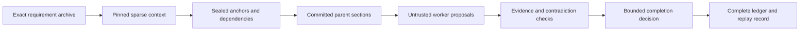
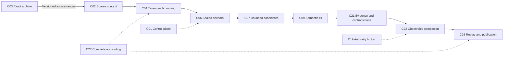

# AI Architecture Dossier

An architectural design portfolio by **novacanenumb**: 28 component contracts covering context, bounded generation, language research, agent control, evidence and measurement.

This release documents the whole design programme and implements a dependency-free sparse context, exact archive and statistical analytics reference slice. Its browser lab executes the same modules as the Node tests. Historical source reports retain their provenance; missing historical code is not reconstructed as an existing contribution.

**Explore the [public architectural dossier](https://novacanenumb-ai-architecture-dossier.novacanenumb.chatgpt.site), [context lab](https://novacanenumb-ai-architecture-dossier.novacanenumb.chatgpt.site/#/lab), and [evidence view](https://novacanenumb-ai-architecture-dossier.novacanenumb.chatgpt.site/#/evidence).** The existing [Headspace PRSR laboratory](https://headspace-prsr-lab.novacanenumb.chatgpt.site) is a separate experimental project whose original fixture source has now been inspected and tested.

<details>
<summary>README navigation</summary>

- [Contribution and design intent](#what-this-work-contributes)
- [Guided reading routes](#guided-reading-routes)
- [Illustrative workflow](#illustrative-research-assistant-workflow)
- [Reproduction and repository navigation](#reproduce)
- [The 28-component guide](#component-guide)
- [Observed comparisons](#comparison-api-and-observed-results)
- [Original-source evidence](#supplied-hypervisor-runtime-probes)
- [Claim interpretation](#reading-an-efficiency-claim)
- [Evaluator checklist](#practical-evaluator-checklist)
- [Matched model experiment design](#designing-a-matched-model-experiment)
- [Contributions and licence](#next-experiments-and-contributions)

</details>

## What this work contributes

The central design question is how an agent workflow can carry less redundant input, preserve exact requirements, coordinate bounded work, and make its eventual output easier to verify. Those goals interact. A small context packet is useful only if it still contains the facts the task needs. Parallel workers are useful only if their outputs can be reconciled within a shared boundary. A convincing performance result needs the cost of retries, reviews, duplicated context and failed attempts as well as the successful final response.

The architecture therefore makes intermediate state explicit. History has versioned source addresses. Context packets declare protected records and byte budgets. Generation work has anchors, dependencies and stopping rules. Candidate outputs remain proposals until the appropriate checks pass. Evidence records preserve disagreement and missing support. Performance records carry measurement provenance and defined denominators. The public dossier makes these interfaces inspectable so a reader can examine the mechanism behind a claimed improvement.

For developers, this repository supplies runnable reference modules, source-bound probes and experiment records. For reviewers, it supplies component contracts, acceptance IDs, failure cases and limitations. For collaborators, it identifies which parts can be extended locally and which need a separate provider experiment or native implementation. The catalogue preserves the broader research programme while the evidence sections identify the behavior actually executed in this release.

Authorship is deliberately traceable: the architectural programme is credited to **novacanenumb**; the portfolio, reference modules and additional probes are AI-assisted work with parent integration. Existing Hypervisor and Headspace implementations retain their own source identity and licensing boundaries. Finding a missing implementation, a failed diagnostic or an unavailable measurement remains part of the contribution record.

## Guided reading routes

The dossier is easier to assess when read as an evidence map. It catalogues 28 components, 122 acceptance requirements, and 154 model-comparison endpoints whose measurements remain `null`. Those numbers describe the scope of the catalogue; they do not mean that every component is implemented, every acceptance requirement passed, or live models were benchmarked.

### Portfolio reviewer

Start with the [component registry](component-registry.json) to see the complete architecture programme and each component's source status and claim boundary. Then read the [contribution map](docs/CONTRIBUTION_MAP.md), which separates the novacanenumb architecture and research programme from the newly authored, AI-assisted dossier implementation.

Continue with the [source inventory](docs/SOURCE_INVENTORY.md) to understand which materials were supplied, which were inspected, and which remain historical designs or uninspected code. The [evidence guide](docs/EVIDENCE.md) explains the receipt vocabulary and the difference between a documented design, an executable reference, an original-source probe, and an unresolved claim. Finish with the [limitations](docs/LIMITATIONS.md) before interpreting an entry's implementation, privacy or validation status.

For a visual tour, open the hosted [Lab](https://novacanenumb-ai-architecture-dossier.novacanenumb.chatgpt.site/#/lab) and [Evidence](https://novacanenumb-ai-architecture-dossier.novacanenumb.chatgpt.site/#/evidence) views. These pages present the same bounded public evidence; hosting does not strengthen the underlying claims.

### Engineer

Begin with the small dependency-free reference lab in [packages/lab/core.mjs](packages/lab/core.mjs). Its purpose is to make selected mechanics inspectable with ordinary Node.js. The default workflow requires Node.js 22 or newer and does not require package dependencies, API keys, provider accounts, or model downloads.

```text
npm test
npm run build
npm run verify
npm run verify:public
npm run preview
```

The default suite currently contains 40 tests, including 16 tests for the newly authored C14 output-level language-analysis reference. Review the frozen comparison setup in [experiments/protocol.json](experiments/protocol.json), the derived results in [dist/data/results.json](dist/data/results.json), and the test record in [experiments/test-receipt.json](experiments/test-receipt.json).

The separate deterministic comparison bundle contains 17 context configurations, including one combined configuration that fails its overflow gate and does not dispatch. Its failure remains in the total configuration denominator. Repetition across configurations demonstrates reproducibility of the fixture mechanics; it does not create independent model trials.

The source-oriented suites have stronger environment requirements than the default lab. The recorded runners use Node.js 26 and the exact original dependencies named by their manifests and receipts. They must not silently run against replacement source or packages.

### Evaluator

Read [docs/CONTEXT_ROUTING.md](docs/CONTEXT_ROUTING.md) before assessing C04. The current record includes 45 supplied-runtime probes plus seven separate C04 tests. The former establish selected behavior against the supplied original implementation; the latter examine additional routing questions. The scheduler record is available at [experiments/runtime/scheduler-results.json](experiments/runtime/scheduler-results.json), and the routing receipt is at [experiments/routing/test-receipt.json](experiments/routing/test-receipt.json).

Across the wider source work, 20 components have partial original-source evidence. That component count is separate from the number of tests. C14 is a new public reference implementation, with original source still unavailable and human or model-performance outcomes unmeasured. Evaluators should preserve those provenance distinctions when comparing coverage.

## Illustrative research-assistant workflow

The following sequence is conceptual. It has not been executed as a validated end-to-end research-assistant DAG, and the arrows do not demonstrate that every architecture layer is implemented.



Imagine a researcher asking for a source-backed comparison with one exact quotation and an unresolved disagreement. The archive would retain the original request and source bytes. A context compiler would select pinned requirements, recent history, and source pointers while preserving the required quotation. The task would be divided into sealed anchors whose dependencies identify the committed parent sections available to later work.

Workers would return proposals. Their text would remain untrusted until checked against the anchor, source receipts, contradiction records, and applicable completion rules. If a required source were absent, preparation would fail or the dependent claim would remain unresolved according to the declared contract. If a parent failed validation, a child depending on its committed output would not receive that output as trusted evidence.

A completion step would accept, reject, or retain unresolved material. The ledger would account for accepted evidence, rejected proposals, failures, corrections, and replay hashes. A later source correction would create a new revision and require affected descendants to be reconsidered, while the earlier accepted record remained addressable.

The dossier retains corrections and failed cases because they make the record useful to audit. A corrected receipt does not rewrite an earlier receipt as though it had always been correct. A failed configuration stays visible in its total attempt count. Missing hosted usage, cost, latency and quality measurements remain `null`. This treatment lets a reader distinguish what was planned, what ran locally, what failed, and what still lacks evidence.

## Reproduce

Use Node.js 22 or later. No packages, API keys or model calls are required.

```text
npm test
npm run benchmark
npm run build
npm run verify
npm run verify:public
npm run preview
```

The preview prints its local URL; `dist` is the static publication directory. Explore the [limitations](docs/LIMITATIONS.md), [contribution map](docs/CONTRIBUTION_MAP.md), [protocol](experiments/protocol.json), and [results](dist/data/results.json).

For a fresh public checkout:

```sh
git clone https://github.com/novacanenumb/ai-architecture-dossier.git
cd ai-architecture-dossier
npm test
npm run build
npm run verify
npm run preview
```

The default workflow has no dependency installation step. `npm test` writes a source-bound test receipt; `npm run benchmark` generates the deterministic context comparison bundle; `npm run build` derives the catalogue and copies the public modules and frozen evidence; `npm run verify` checks the resulting release. `npm run verify:public` repeats the public source workflow in a temporary isolated copy without the private master specification or supplied runtime. Optional source probes are described separately below and require their corresponding original dependency.

## Repository navigation

```text
ai-architecture-dossier/
  README.md                         Public entry point and reproduction guide
  component-registry.json           Sanitized 28-component source registry
  packages/lab/                     Executable archive, context and analytics APIs
  tests/                            Public reference behavior and known vectors
  scripts/                          Builds, probes, benchmarks and release checks
  docs/                             Provenance, boundaries and contribution maps
  experiments/native/               Retained native source-validation records
  experiments/runtime/              Supplied-runtime probes and scheduler results
  experiments/headspace/            Original-source checks and commit diagnostic
  experiments/agentdb/              Original offline tests and paired cache experiment
  experiments/language/             Fixed-window C14 analyser and eligibility checks
  experiments/routing/              Original-source committed-parent handoff probes
  dist/                             Static site and downloadable derived evidence
  .openai/hosting.json               Existing Sites project and output declaration
  LICENSE                           Custom licence for this repository's additions
```

Start with the [source inventory](docs/SOURCE_INVENTORY.md) to understand which implementations were inspected, then use the [evidence guide](docs/EVIDENCE.md) to find the reference results. The [runtime guide](docs/RUNTIME_EVIDENCE.md) explains optional Hypervisor checks; the [Headspace guide](docs/HEADSPACE_EVIDENCE.md) explains original fixture checks and the new concurrency diagnostic. The [Agent Database guide](docs/AGENTDB_EVIDENCE.md) records offline memory, governance, signing and cache evidence. The [reuse plan](docs/REUSE_PLAN.md) records ownership boundaries for further implementation.

## Architecture and design intent

The programme separates exact history, task context, generation boundaries, worker proposals, evidence validation and permission to change external state. A smaller inference packet remains useful when its protected facts survive and its original sources stay addressable. Each boundary has its own contract: a proposed answer does not authorize a tool, and an exact-text match does not establish an external claim's truth.



This is a conceptual path through the catalogue, not a validated execution DAG or a requirement to run every component on every task. Small tasks can use fewer mechanisms. API-level parallel generation, experimental language composition and model-native decoder research have different interfaces and evidence requirements.

The site presents four flagship families—sparse context, anchor-bounded generation, Headspace and multi-agent context routing—and seven views for each component: Overview, Lab, Architecture, Tests, Benchmarks, Failure Cases and Documentation. The shared context lab executes the same core modules as the Node tests. Unavailable mechanisms retain an explicit status.

## Component guide

The [component registry](component-registry.json) preserves historical source status separately from implementation in this checkout. “Design” below means documented here; original historical source code has not been inspected. “Reference” means a bounded new implementation with partial acceptance evidence.

| ID | Component | Scope in this release |
| --- | --- | --- |
| C01 | Hypervisor control plane | Design |
| C02 | Sparse context compression compiler | Reference slice |
| C03 | Exact archive and context materializer | Reference slice |
| C04 | Multi-agent context routing | Seven original-source handoff checks; source-selection limits disclosed |
| C05 | Cache hierarchy and invalidation | Design |
| C06 | Anchor compiler and sealed boundary graph | Design |
| C07 | Anchor-bounded parallel generation: ABES | Design |
| C08 | Native bidirectional multi-anchor decoding | Native research design |
| C09 | Semantic intermediate representation and patch reducer | Design |
| C10 | Rotating expert synthesis and bounded local repair | Design |
| C11 | Headspace polyphonic composition | Experimental design |
| C12 | Dialect dictionaries, probability profiles and user-model packages | Design |
| C13 | Prefix-state proposal and commitment layer | Design |
| C14 | Language diversity and convergence analyser | Design and reference statistical utilities |
| C15 | Measured routing and adaptive compute allocation | Design |
| C16 | 02_SOULS definition and lifecycle registry | Historical design |
| C17 | Agent database and scoped memory dossiers | Design |
| C18 | Bootstrap compiler and qualification bootcamp | Design |
| C19 | Authority broker and command bus | Design |
| C20 | Signed working agreements and attestation | Design |
| C21 | Evidence ledger and contradiction verification | Design |
| C22 | GTFL positive-state execution kernel | Design; separate native-run receipts supplied |
| C23 | RTL360-GTFL native language model | Native research design |
| C24 | Rotor, harmonic and hierarchical lattice routing | Native research design |
| C25 | Collapsed Route-State Cache and approved S3L memory | Native research design |
| C26 | Native training, checkpoint promotion and neural laboratory | Native research design |
| C27 | Telemetry, analytics and benchmark evidence engine | Reference slice |
| C28 | Replay, reproducible releases and portfolio publication | Design and current publication tooling |

The catalogue includes **122 acceptance requirements** and **154 specified metric endpoints**. Full component acceptance is not claimed: the evidence matrix uses `PARTIAL_REFERENCE_EVIDENCE` and `NOT_RUN`. A passing local fixture cannot complete a native decoder, a hosted provider evaluation or a production authority service.

The table records the public reference implementation scope. Current source inspection adds partial evidence from the supplied Hypervisor across 12 components and from the original Headspace fixture for C11–C13; the detailed sections below describe that evidence without promoting the entire component contract to complete.

## How the component families fit together

**Context and memory — C02–C05.** The exact archive supplies stable revision and span addresses; the sparse compiler selects the protected and task-relevant material that a worker receives. Context routing allocates evidence across workers and accounts for shared input. Cache hierarchy and invalidation are a separate design concern because a reused answer or index must still match its source revision, scope and task conditions. The reference comparison makes the transport trade-off observable, including cases where routing overhead exceeds the savings from a single sparse packet.

**Generation and revision — C06–C10.** A sealed anchor describes what a section must preserve, which sources it depends on and where it may change. ABES schedules bounded candidates against those anchors. Semantic IR provides a structured revision surface; rotating synthesis and local repair describe how disagreement could be reduced without reopening every accepted section. C08's bidirectional multi-anchor decoder requires model-native support and retains a research status. Executing application-level anchors does not demonstrate that decoder capability.

**Language composition — C11–C14.** Headspace explores complementary logical language profiles, dictionaries and prefix commitments. Its original PRSR browser fixture makes proposals, authored matrix weights, fresh prefix frames and contributor order observable. The diversity analyser supplies hypotheses and metric definitions for comparing language behavior. A deterministic fixture can establish trace invariants and arithmetic, while semantic quality, vocabulary generalization and human outcomes need their own experimental evidence. Five logical profiles do not by themselves establish five distinct hosted models.

**Agent organization — C15–C18.** Measured routing uses observed evidence to choose future bounded work. Lifecycle definitions, agent dossiers and scoped memory distinguish persistent identity and knowledge ownership from an individual task's prompt. Bootstrap compilation and qualification describe how those definitions could be checked before use. The catalogue preserves the historical C16 label while current integration avoids creating a second registry beside the existing Agent Database owner.

**Authority and evidence — C19–C22.** Tool permissions, signed agreements, source-backed claims and positive-state completion have separate contracts. A worker's proposed command is not authority to execute it. A hash establishes content binding, while publisher or human identity needs an additional trusted mechanism. The supplied runtime probes establish selected local attenuation, contradiction, deduplication and GTFL behaviors. They do not establish operating-system confinement, authenticated human approval or every production integration.

**Native research — C23–C26.** RTL360-GTFL, rotor and lattice routing, route-state caching, training and checkpoint promotion describe work below the ordinary API orchestration layer. Their acceptance requirements remain useful as research targets. This public release supplies no trained checkpoint, decoder mask, measured neural compute advantage or successful promotion experiment for those components.

**Measurement and publication — C27–C28.** Complete accounting binds conclusions to the calls, source versions and exclusions that produced them. Replay checks stored artifacts and hashes; it does not regenerate a hosted model deterministically. Reproducible releases preserve the public implementation, evidence bundles and native receipts so a later experiment can be compared with an earlier recorded state.

## Exact archive API

[`ExactArchive`](packages/lab/core.mjs) is an in-memory reference store. It retains exact byte-addressable revisions with SHA-256 hashes, checks correction preconditions, filters by explicit ownership scope, and purges raw historical bytes on deletion. Returned byte arrays and metadata are defensive copies.

```js
import { ExactArchive } from './packages/lab/core.mjs';

const archive = new ExactArchive();
const first = await archive.append({
  id: 'public-example', content: 'A😀B', metadata: { synthetic: true }
});
// UTF-8 byte offsets 1..5 select the complete emoji.
const span = archive.materialize({
  id: 'public-example', version: first.version, startByte: 1, endByte: 5
});
console.log(span.text); // 😀
await archive.correct({
  id: 'public-example', content: 'A revised public example',
  expectedVersion: first.version
});
console.log(archive.materialize({ id: 'public-example', version: 1 }).text);
archive.delete({ id: 'public-example' }); // purges every raw version
```

The default scope is `public`. A scope callback is a local policy hook; it does not authenticate humans. The archive is not a durable multi-user database or a replacement for every C03 projection. The current browser lab demonstrates context packets; archive lifecycle behavior is exposed through this API and its tests.

## Comparison API and observed results

The comparison API generates a public synthetic history and executes five context-selection arms on the same permitted source records:

```js
import { runComparison } from './packages/lab/core.mjs';

const result = await runComparison({
  historySize: 64, budgetBytes: 6000,
  recentCount: 12, retrievalLimit: 12, workers: 4
});
console.log(result.arms.sparse.bytes); // 3892
console.log(result.arms.combined.exactFactRecall); // 1
console.log(result.arms.combined.cost); // null
```

Sparse packing retains pinned policy and required exact facts atomically. Insufficient budgets return `PINNED_OVERFLOW` and prevent dispatch. Combined routing partitions required facts across workers, counts shared pins in every packet, and includes routing overhead. Navigation bridges never replace exact source evidence.

The main configuration contains 64 synthetic milestones, 129 source records, a 6,000-byte budget per bounded packet and four workers.

| Arm | Serialized input bytes | Required exact-span coverage |
| --- | ---: | ---: |
| Full context | 37,075 | 100% |
| Recent tail | 3,600 | 0% |
| Lexical retrieval | 3,566 | 100% |
| Sparse exact packing | 3,892 | 100% |
| Combined worker routing | 4,440 | 100% |

The full arm is a **model-free full-context baseline**. Bytes are measured UTF-8 JSON transport, including headers and duplicate shared inputs. Exact-span coverage checks whether required synthetic facts are in packets; it does not score generated answers. Combined routing uses more bytes than the sparse arm in this fixture.

The benchmark attempts 16 ordinary configurations and one deliberate overflow. All 17 remain in the failure-rate denominator. Failed configurations receive no claimed efficiency gain; the failed pair is explicitly omitted from the byte bootstrap and its exclusion count is retained. Related configurations and repeated histories are not independent population tasks.

No standalone hosted model was executed. The full Hypervisor has not been benchmarked against standalone models here. Historical source reports of 147 tests, 16/16 needles and 95.758% byte reduction are not reused as current measurements. All 154 default-model endpoint comparisons remain unavailable until matched component/backend experiments run.

## Statistical analytics with known vectors

[`analytics.mjs`](packages/lab/analytics.mjs) defines guarded ratios, token amplification, accepted-token throughput, complete workflow usage and cost aggregation, seeded paired bootstrap, Unicode MATTR, repeated trigram rate, sample coefficient of variation and aligned-support base-2 Jensen–Shannon divergence.

```js
import { tokenAmplification, pairedBootstrap, mattr,
  repeatedTrigramRate, jensenShannon } from './packages/lab/analytics.mjs';

console.log(tokenAmplification(1200, 800).value); // 1.5
console.log(mattr('a b a c', 3).value); // 5 / 6
console.log(repeatedTrigramRate('a b c a b c a b c').value); // 4 / 7
console.log(jensenShannon([1, 0], [0, 1]).value); // 1 bit
console.log(pairedBootstrap({
  baseline: [1, 2, 3], candidate: [2, 3, 4],
  iterations: 2000, confidence: 0.95, seed: 1729
}).interval); // [1, 1]
```

Known-vector tests establish the arithmetic. Missing observations stay null; cached input and reasoning tokens are treated as subsets instead of added twice. Failed, retry and review calls remain in total workflow accounting. Fixed configuration confidence intervals do not establish Headspace language quality, human outcomes or model noninferiority.

## Validation, provenance and contribution history

The original 24 behavioral and statistical tests cover Unicode bytes and boundaries, scope isolation, correction history, race preconditions, deletion, deterministic ranking, pinned overflow, source-span recall, complete transport accounting and statistical vectors. The expanded suite has 40 passing tests, including 16 C14 analyser checks described below. All 17 context fixture configurations reproduced exactly on a second execution. See the [evidence guide](docs/EVIDENCE.md), [test receipt](experiments/test-receipt.json), [release report](experiments/release-verification.json) and [public-checkout report](experiments/public-checkout-verification.json).

`npm run verify:public` reconstructs a source copy without the original master specification or supplied runtime, then runs its tests, build and release checks. Public builds use the committed sanitized registry. The preview binds to `127.0.0.1`, prints its actual URL, and serves `/api/health`; set `DOSSIER_PORT` to choose another local port.

The architecture programme is credited to **novacanenumb**. The catalogue derivation, JavaScript reference mechanisms, tests and presentation are AI-assisted new work with parent integration. They do not reconstruct missing historical implementations as inspected source. Original documents remain outside this public checkout. The derived catalogue records the specification identifier, source IDs, line references and digest.

The native source-proposal run reached ephemeral `REPORTED` completion with three Sol-role proposals, schema/anchor checks, the nonempty validator and valid GTFL collapse. Its [receipt](experiments/native/receipt.json), [manifest](experiments/native/manifest.json), [ledger](experiments/native/tokenLedger.json) and [performance record](experiments/native/performance.json) remain separate from host behavioral tests. No general semantic validator or durable runtime commit is claimed. Runtime timings include orchestration and proposal waits; their serial-equivalent ratio is not an executed standalone-model benchmark.

Finite secret-pattern checks are not a comprehensive security audit. The task-scoped `HYPERVISOR_BYPASS_APPROVED` exception covers Git initialization, commits, remote setup and pushes; those actions are not Hypervisor Git-handler validated mutations. It does not authorize paid provider calls or redistribution of the supplied runtime.

## Supplied Hypervisor runtime probes

The supplied **Hypervisor 2.1.0 implementation** now has a separate suite of **45 executed behavioral probes**, all passing with zero failures or skips. These establish partial local mechanism evidence across 12 components: C01, C02, C03, C06, C07, C09, C15, C19, C21, C22, C27 and C28. They complement the 24 public reference tests and do not replace the full component acceptance contracts.

The probes exercise bounded scheduling, measured-routing provenance, immutable future routing revisions, atomic GTFL frames, deduplicated support, capsule replay, complete ephemeral fixture run bundles, exact archive hashes, header reconstruction, pinned overflow, deterministic retrieval, anchor dependency gates, protected section revisions, authority attenuation, evidence contradictions and complete usage arithmetic. Their runner checks the approved dependency manifest, content root, complete file set and all 85 member hashes before importing runtime code. The separately licensed runtime remains outside this repository and the deployment.

Run `npm run test:runtime` with Node 26 or later and the approved dependency at `../HYPERVISOR-2.1-STABLE`; set `DOSSIER_RUNTIME_PATH` when it is elsewhere. This command fails explicitly if the package is absent or differs from the approved source. The regular reference tests and public site still work without it.

Read the [runtime evidence guide](docs/RUNTIME_EVIDENCE.md), [executed probe receipt](experiments/runtime/test-receipt.json), [partial acceptance map](experiments/runtime/coverage.json), and [native source receipt](experiments/runtime/native/receipt.json). These tests establish implemented local behavior using synthetic inputs; hosted model quality, token consumption, billing and inference latency remain unmeasured.

## Measured serial versus concurrent scheduling

The supplied scheduler also ran a frozen four-task dependency graph under concurrency 1 and concurrency 3. Three independent tasks use abort-aware timer waits of 12, 18 and 24 milliseconds; the join waits 6 milliseconds after its parents finish. Every callback returns the same deterministic integer result in both arms. Eight pairs alternate which arm runs first. All 16 attempts are retained, with zero failed attempts, eight eligible pairs, zero exclusions and equal output hashes.

| Locally observed measure | Result |
| --- | ---: |
| Executed serial mean scheduler wall time | 93.81 ms |
| Executed concurrent mean scheduler wall time | 46.41 ms |
| Ratio of paired means | 2.02× |
| Paired mean difference, concurrent minus serial | −47.40 ms |
| 95% seeded percentile bootstrap interval | −49.41 to −46.26 ms |

This ratio measures overlap of controlled asynchronous waits on the recorded machine. Timer resolution, host load and orchestration affect the observed durations. It does not establish neural compute speed, provider latency, streamed throughput, model quality or billing. The confidence interval describes the recorded paired fixture observations; it does not establish a population result or model noninferiority. Summed callback duration remains a separately labelled serial estimate; the reported comparison uses an actually executed serial baseline.

Run `npm run benchmark:scheduler` separately with the verified runtime and Node 26 or later. The [frozen protocol](experiments/runtime/scheduler-protocol.json) records the DAG, limits, pairing order and statistic before execution. The [full attempt log](experiments/runtime/scheduler-results.json) retains callback intervals, scheduler bounds, validated DAG critical paths, source hashes and unknown model measurements. The bootstrap uses 4,000 iterations, 95% confidence and seed 1729; it reproduces exactly for the recorded vector. Wall-clock times themselves are not deterministic. Static builds copy this frozen report and do not rerun timing experiments.

The added test sources and benchmark runner have a separate [native source receipt](experiments/runtime/native-scheduler/receipt.json). Native source validation and parent behavioral verification have different scopes. The earlier [23-probe receipt](experiments/runtime/history/23-probe-release/test-receipt.json), runner bytes and native artifact remain intact, so publication history is inspectable.

## Original Headspace source and concurrent-commit evidence

The existing `prsr-sites` 1.0.0 prototype was located at `N:/Development/Architecture/Headspace/prsr-sites`. Its original browser fixture, generated validators, comparison adapter, test schemas and examples were inspected before execution. The dossier pins 13 source files in a [source manifest](experiments/headspace/source-manifest.json), copies only those inspected files to an owned temporary directory, runs the original tests there, and verifies every original hash again afterward. The original project remains unchanged and its source is excluded from this repository.

The original suite passed **16 fixture checks** covering contributors, exact prefixes, normalized authored frames, rejection of stale proposals, protected text, stop behavior, replay, checkpoint restoration, branching, shuffle diagnostics and configuration tampering. Its mocked comparison suite passed **17 checks** using injected streaming responses. Those checks exercise the comparison adapter and bounded dispatch; they do not verify paid-provider behavior or language quality. No live model call was made.

A new diagnostic calls `.commit(proposal)` twice concurrently against the same prefix revision for each of 12 fixed seeds. The original API accepted both calls in all 12 cases, producing duplicate transitions and an invalid event chain. This is a direct API concurrency trigger; it does not establish that ordinary sequential use of the existing browser interface has the same behavior. The existing passing tests had not covered this trigger.

The dossier adds a small [serialization adapter](packages/lab/serialized-commit.mjs) that queues commit attempts within one simulator instance. With the same inputs, every adapted pair accepted exactly one commit, rejected the stale second attempt, retained one fragment and verified its trace. The adapter also preserves thrown errors and allows the queue to continue afterward.

| C13-T01 diagnostic arm | Failed requirements | Denominator | Observation |
| --- | ---: | ---: | --- |
| Original direct concurrent API | 12 | 12 | Two accepted commits; invalid event lineage |
| Original API with new per-instance adapter | 0 | 12 | One accepted commit; valid event lineage |

This is a bounded in-process correction, with no claimed rollback, durable transaction or cross-process exclusion. The adapter has not been installed in the original Headspace project or its existing public deployment. The [receipt](experiments/headspace/test-receipt.json) retains every baseline failure and adapted result, and the [native source receipt](experiments/headspace/native/receipt.json) binds the three newly proposed source files.

A [public synthetic trace](experiments/headspace/public-trace.json) records one sentence, five fragments and 90 hash-linked events generated with an empty source inventory. Its events and transcript reproduced exactly for seed 4096; timing telemetry remains variable. The authored probability-like weights are fixture computations, with backend scores null. They are not measured model probabilities, trained embeddings or independent semantic validation.

Reproduce with Node 26 or later, the approved Hypervisor dependency and the exact original source files:

```text
npm run test:headspace
```

Set `HEADSPACE_SOURCE_PATH` when the original source is elsewhere and `DOSSIER_RUNTIME_PATH` for the approved dependency. Missing or changed source fails explicitly. The default fetch guard and allowlisted child environment are best-effort local controls; operating-system network confinement is unavailable. Builds copy the recorded evidence and never invoke the original tests or a model.

## Original Agent Database: memory, governance and signing

The active Python implementation was located at `N:/Development/Production/Hypervisor Standalone/01_AGENT_DATABASE`. Its canonical component is `hypervisor.agent_database`, and its package identifies `orpheus-agent-dashboard` 0.1.0. The Python service owns active state; the retired Node draft is historical. The original ownership documentation also marks SOULS as a deprecated legacy field. The dossier therefore links observed memory, bootstrap and contract behavior to the actual Agent Database owner and does not claim a complete current C16 SOULS registry implementation.

The [source manifest](experiments/agentdb/source-manifest.json) pins 19 inspected files: eight owning Python modules, seven migrations, three original test files and package metadata. The optional runner copies those files into an owned temporary directory, uses synthetic SQLite state, runs the original offline tests and new probes, then verifies all original source hashes again. Original project state, credentials, workers and provider transports are excluded. Original code is not redistributed or relicensed by this repository.

The current [receipt](experiments/agentdb/test-receipt.json) records **39 passing original tests** and **10 passing additional probes**, with no failures, errors or skips. This adds partial source evidence for four components:

| Component | Observed local behavior | Evidence limit |
| --- | --- | --- |
| C05 — cache hierarchy | Cold/warm output equality; tenant, document-grant and expiry checks; source correction invalidation | Application retrieval cache only; no complete hierarchy, tokenizer identity or provider cache claim |
| C17 — memory and knowledge | Selected memory fork behavior, admission restrictions, provenance and retained conflicting assertions | No real-worker relaunch, backup recovery or truth adjudication |
| C18 — bootstrap | Seeded synthetic persona and package repeatability with frozen source state and validity clock | No held-out qualification, active agreement or campaign activation demonstrated |
| C20 — contracts and signatures | Exact-byte signature binding, challenges, approval revisions and revocation paths; altered signed term rejected | Synthetic roles and local ephemeral keys; no authenticated human consent or independent key custody |

The new term-alteration probe first verifies both signatures over an approved synthetic contract, then changes only `terms.retention_days`. Both original signatures fail verification over the changed bytes. The public record contains counts and the changed field, with no private keys or signature values. Separate demo keys in one process demonstrate byte binding, not independent custody.

The bootstrap probe freezes both source state and the validity clock. Repeating that fixture produces the same digest; advancing the clock by 60 seconds changes the expiry and package hash. A fixed persona seed alone does not make the entire package deterministic. This fixture has no active agreement or qualification result, so repeatability does not establish permission to activate a worker.

Two earlier [setup attempts](experiments/agentdb/history/attempt-1/test-receipt.json) failed before original test collection. Their receipts and runner bytes remain, including [attempt 2](experiments/agentdb/history/attempt-2/test-receipt.json). The local write guard rejected pytest's default device log. The corrected runner directs the log into its owned directory without weakening that guard. A subsequent [39-test / 9-probe passing receipt](experiments/agentdb/history/attempt-3/test-receipt.json) is retained alongside the current ten-probe result.

## Measured cleared versus primed retrieval cache

The [frozen cache protocol](experiments/agentdb/cache-protocol.json) executes the original `Memory.search` against 32 synthetic documents. Eight counterbalanced pairs compare two application-cache states. The baseline clears the retrieval cache before every measured query. The candidate clears it, performs one retained priming call, then measures 16 queries. Each query uses the same text, byte budget and ten-result limit. Output comparison hashes text, source, kind and revision while excluding generated identifiers and clock fields.

All **16 arms**, **256 measured queries** and **8 priming calls** are retained. No measured query failed or remained undispatched; all eight pairs were eligible and their normalized output hashes matched.

| Locally observed query measure | Result |
| --- | ---: |
| Cleared application-cache mean | 0.834 ms |
| Primed application-cache mean | 0.077 ms |
| Ratio of paired means | 10.835× |
| Paired mean difference, primed minus cleared | −0.757 ms |
| 95% seeded percentile bootstrap interval | −0.768 to −0.746 ms |

External `time.perf_counter` measures each original search call. Corpus setup, cache clearing and priming are excluded from these query durations; priming duration is recorded separately. The original internal telemetry records cold retrieval latency but omits latency samples for warm hits, so external timing is necessary for this comparison. The result is conditional on this local synthetic SQLite workload and machine. It does not measure an operating-system cold cache, end-to-end workflow overhead, model inference, hosted tokens, quality or billing.

The paired bootstrap uses 4,000 iterations, confidence 0.95 and seed 1729. It reproduces exactly for the recorded eight-pair vector; wall times vary across executions. The complete query log, denominator and source bindings are in the [receipt](experiments/agentdb/test-receipt.json), with [partial acceptance coverage](experiments/agentdb/coverage.json) and a separate [native source receipt](experiments/agentdb/native/receipt.json).

Reproduce separately with Node 26 or later, the approved Hypervisor dependency, the exact original Agent Database source and Python 3.12:

```text
npm run test:agentdb
```

Set `AGENTDB_SOURCE_PATH` for source location, `DOSSIER_PYTHON_PATH` for the interpreter and `DOSSIER_RUNTIME_PATH` for the dependency. The recorded library versions are pytest 9.1.1, pydantic 2.13.5, cryptography 50.0.1 and rfc8785 0.1.4. Source or dependency mismatch fails explicitly. The runner disables plugin autoload and bytecode writes, uses an allowlisted child environment, and applies a best-effort audit hook to reject network, subprocess and writes outside its temporary copy. Operating-system confinement remains unavailable. Static builds copy the frozen report and do not invoke Python or rerun the experiment.

The source-proposal receipt records two native candidate contracts and three actual host proposal turns, including a clarification follow-up. The native ledger does not account for that extra host turn or prove enforcement of a host call limit. Token usage and cost remain unknown. Native schema/anchor validation and the separately executed Python tests have different scopes.

## C04: committed parent handoffs and source-selection boundaries

The [original-source routing suite](experiments/routing/handoff.test.mjs) adds **seven passing behavioral checks** against the supplied Hypervisor 2.1.0 implementation. It is separate from the existing 45 runtime tests. The new probes import the same immutable, separately licensed runtime after its complete manifest and content hashes are verified; no original source is redistributed.

The four-anchor fixture produces sections for `a`, `b`, `unrelated` and `child`. The child depends on `a` and `b`. Actual execution delivers both complete committed parent sections, with content hashes matching the final artifact, and excludes the unrelated parent section. An invalid parent proposal prevents dependent child dispatch. Missing required source aliases and graph dependencies fail preparation with `ANCHOR_SOURCE_UNAVAILABLE` and `MISSING_DEPENDENCY`.

The source diagnostic exposes a separate boundary. Both tiny approved public source records appear in every materialized context, even where an anchor names only one alias. `sourceIds` preserve mandatory records; they are not a restrictive permission filter. Dependency selection for committed parent sections does not prove private source isolation. The lower-level `taskPacket` helper also accepts caller-supplied parent sections; its clone, freeze and byte-budget checks do not independently prove those sections were committed or authorized.

The [recorded diagnostic](experiments/routing/test-receipt.json) accounts for all four local callbacks and their four ledger events. Actual delivered packets total **15,445 bytes**. A constructed broadcast control containing the same archive and all prior outputs totals **16,040 bytes**. The 595-byte difference comes from the child's unrelated parent section. Both controls retain duplicated source contents: 156 delivered source-content bytes from 39 unique bytes. The broadcast packet is an accounting construction, not a separately executed model or a measured broadcast workflow.

```sh
npm run test:routing
```

Use Node 26 or later and the approved runtime, with `DOSSIER_RUNTIME_PATH` when necessary. The [source guide](docs/CONTEXT_ROUTING.md) maps partial C04-T01, C04-T03 and C04-T04 evidence and keeps automatic global contradiction discovery unresolved. The first run's reservation-budget failure, its receipt and its exact probe/runner bytes remain in history; the corrected allowance keeps the same scenarios and public inputs. Native source validation and parent behavioral testing have separate receipts.

These counts describe public synthetic packets and exclude hidden host prompts, provider framing and tokenizer behavior. They do not establish model token savings, billed cost, hosted latency, answer quality, private context non-disclosure or a complete component acceptance pass.

## C14: controlled language analysis

The dossier now includes a real local [output-level language analyser](packages/lab/language-analysis.mjs), supported by the existing statistical functions. This is a new reference implementation of C14's specified first deliverable. Original C14 source was not recovered, and the longitudinal research hypothesis remains untested.

Inputs declare participant kind, topic, task and segments labelled as authored text, quotation or required technical terms. Each category has separate counts. A fixed authored-word sample prevents a shorter, all-unique output from receiving an apparent benefit merely through raw type-token ratio. Insufficient windows retain null metrics. Quotation and required-term annotations are supplied by the caller; they are not automatically inferred or independently verified.

MATTR uses the same authored sample size and declared window across arms. Repeated trigrams preserve segment boundaries, so excluding quoted text cannot manufacture a phrase joining two separate authored spans. Sentence-length variation includes only complete retained sentences and discloses its simple punctuation convention. Lexical Jensen–Shannon divergence aligns the sorted union of observed word frequencies; those frequencies are not model probabilities.

Comparison requires matching topic, task, participant kind, sample size and MATTR configuration. Topic changes and short samples are explicitly ineligible, with derived values null. Caller topic labels are a measurement control, not a semantic topic verifier. Human descriptors do not produce human-outcome or cognitive claims.

The [frozen fixture](experiments/language/results.json) retains four configurations and 12 comparison attempts: six eligible and six deliberately rejected. Its initial, middle and late windows use labelled authored synthetic patterns, not model generations. All runs reproduced exactly. The public suite now has **40 passing tests**, including **16 focused analyser checks**. The [coverage map](experiments/language/coverage.json) links C14-T01 through C14-T04 to tests and precise exclusions. Earlier 24-test evidence and the initial numerical-assertion failure remain in history.

Open [C14's component page](https://novacanenumb-ai-architecture-dossier.novacanenumb.chatgpt.site/#/component/C14) and select Lab to change authored sample size, MATTR window and candidate pattern. Buttons inject topic mismatch or require more words than the fixture contains. The export preserves synthetic inputs, excluded quotation/term counts, truncation and every comparison outcome.

```text
npm test
npm run measure:language
npm run build
npm run preview
```

See the [analyser guide](docs/LANGUAGE_ANALYSIS.md) and [native source receipt](experiments/language/native/receipt.json). These checks establish local measurement and eligibility behavior. Semantic consistency, unfamiliar-partner transfer, blinded human ratings, cognitive effects and matched model-generation benefits remain unavailable.

## Reading an efficiency claim

Every result should identify the work unit, baseline, measurement and acceptance gate. In the context fixture, the work unit is serialized UTF-8 input and the acceptance gate is required exact-span coverage. In the scheduler fixture, it is an actual bounded DAG execution with equal deterministic callback outputs. In the Headspace diagnostic, it is two competing commits against one revision with a verified unique next span. Those are distinct claims with distinct denominators.

A smaller byte count does not establish fewer billed tokens unless provider usage is observed. A faster asynchronous fixture does not establish faster neural inference. Deterministic event replay does not establish semantic noninferiority. The records keep these quantities separate so future provider-backed work can add measurements without rewriting the meaning of the existing results.

For a matched model comparison, freeze the task corpus, protected requirements, model and backend revisions, arm configuration, quality rubric, tolerance, call limit and budget before dispatch. Retain all successful, failed, cancelled, retry and review calls. Define cache inclusion and token subsets explicitly. Compute ratios only with known nonzero denominators, and report missing observations as null. A combined Hypervisor comparison must include its orchestration and review overhead as well as the final answer.

## Practical evaluator checklist

Evaluate each claim against the evidence class it uses. A passing fixture shows that a bounded mechanism behaved as recorded under that fixture. Broader conclusions require their own population, experiment and validation.

1. Run `npm run verify:public` to check the public release without the private specification or original runtime. Confirm that files, source hashes, schemas, denominators and unavailable fields remain consistent.
2. Read [EVIDENCE.md](docs/EVIDENCE.md), [LIMITATIONS.md](docs/LIMITATIONS.md), and [CONTRIBUTION_MAP.md](docs/CONTRIBUTION_MAP.md). Follow the relevant [runtime](docs/RUNTIME_EVIDENCE.md), [Headspace](docs/HEADSPACE_EVIDENCE.md), [Agent Database](docs/AGENTDB_EVIDENCE.md), or [language-analysis](docs/LANGUAGE_ANALYSIS.md) guide for its precise execution boundary.
3. Identify whether the claim concerns a deterministic output, local wall time, or hosted generation. Preserve that classification when reporting the result.
4. Inspect [protocol.json](experiments/protocol.json), [results.json](dist/data/results.json), and [test-receipt.json](experiments/test-receipt.json). Check the frozen inputs and every attempted configuration. Report total attempts and eligible comparisons separately, with failed and excluded cases retained.
5. For scheduling, inspect the [protocol](experiments/runtime/scheduler-protocol.json) and [results](experiments/runtime/scheduler-results.json). The record contains 16 actual timer attempts across eight counterbalanced pairs with equal deterministic callback outputs. It measures this local scheduler fixture.
6. For retrieval caching, inspect the [cache protocol](experiments/agentdb/cache-protocol.json) and [Agent Database receipt](experiments/agentdb/test-receipt.json). The record distinguishes 16 arms, 256 measured queries, eight priming calls and eight eligible pairs.
7. For language analysis, inspect the [frozen results](experiments/language/results.json). C14 is a new reference implementation; the authored synthetic patterns and caller-supplied segment labels remain separate from measured model or human outcomes.

The default public suite has 40 tests, including 16 C14 tests. Its separate context comparison bundle has 17 configurations and one retained combined-overflow failure. Optional original-source commands include `npm run test:runtime`, `npm run test:routing`, `npm run test:headspace`, `npm run test:agentdb`, and `npm run benchmark:scheduler`. Their manifests and receipts declare the required original source, runtime and environment. Missing source or a version or hash mismatch fails explicitly.

## Claim review template

Use this compact record when contributing or assessing a material claim:

```text
Claim:
Evidence class: deterministic fixture | local timing | hosted generation | unavailable
Source files and hashes:
Protocol and frozen revisions:
Population and denominator:
Failed, retried, cancelled and excluded attempts:
Observed value and unit:
Null or unavailable measurements:
Validator or reviewer and validation scope:
Supported scope:
Unsupported extrapolations:
Reproduction command:
```

The catalogue's 154 model-comparison endpoints retain `null` baseline and candidate values because matched model runs have not occurred. Zero provider calls is an observed call count; an unavailable token, cost, latency or quality value is a missing measurement. A null field preserves the work still needed to establish a result.

## Deterministic outputs, timing and generation

A content hash, replay equality, or fixed callback result can be deterministic while elapsed time varies. Timing claims therefore need per-attempt observations, a declared clock, complete failure accounting, and an analysis tied to the tested workload. Hosted model generation needs additional provider identity, backend revisions, usage, latency and quality evidence. Local fixture arithmetic cannot supply those observations.

Headspace illustrates the distinction. Its record contains 16 original fixture checks and 17 mocked comparison checks. The original competing-commit behavior fails the stated requirement in 12 of 12 diagnostic pairs; the new serialized adapter fails in zero of 12, while the original source remains unchanged. That supports the bounded adapter result. Cross-process coordination, rollback and durable distributed transaction behavior need separate implementation and tests.

Replaying a retained artifact verifies its recorded content and bindings. Regenerating a hosted response is a different operation, even when the prompt and requested seed are unchanged. Statistical intervals over local wall times describe the sampled local workload; they do not establish answer quality or generalize automatically to another machine or provider.

## Designing a matched model experiment

Before either arm runs, freeze the corpus, protected requirements, model and backend revisions, quality rubric, tolerance, cache policy and stopping rules. Both arms must solve the same task. Account for each arm's actual orchestration, retries, reviews, failures and validation overhead. The combined Hypervisor arm must include the work required to produce its accepted answer.

Counterbalance paired arm order. Record cache state per arm, including any priming whose time is excluded from a query measurement. Retain every attempt, including cancelled and undispatched work, with exact total and eligible denominators. Usage subsets must state how input, cached input, cache writes, retrieval and output are counted. Byte totals and estimated tokens do not substitute for provider usage or streamed throughput.

Declare the quality gate and analysis before observing results. Check output equality where appropriate, or use the frozen quality rubric and tolerance, before interpreting a speed comparison as an efficiency benefit. If the gate fails or lacks evidence, report timing and quality separately. Recompute paired statistics from eligible observations, disclose exclusions, and keep undefined ratios null when a required denominator is absent or zero.

## Reproduction and contribution troubleshooting

A public checkout runs the dependency-free lab with Node.js 22 or newer. Original-source checks require the exact environments described in their guides; the recorded optional runners use Node.js 26, and Agent Database checks also require the declared Python libraries. A static build copies frozen optional evidence rather than rerunning those private-source experiments. Rebuilding the site therefore does not refresh every measurement.

When a source hash differs, identify the changed source and create a new experiment revision before claiming comparability. When a test fails, preserve the trigger, receipt and affected denominator. When a protocol changes after execution, retain the earlier protocol and start a separately identified comparison. Content hashes establish consistency with recorded bytes; publisher authentication needs an independently trusted signature.

A hypothetical contribution could add a cache policy in the existing owner. Its proposed protocol would freeze a synthetic corpus, paired arms, query order, priming, complete failure accounting and a quality-equivalence gate. Tests would check the policy and schema before an authorized measurement run. The raw receipt and derived comparison would be added only after execution, labelled with their observed scope. Until then, the contribution would remain an implementation and experiment proposal.

## Next experiments and contributions

Further evidence requires the relevant actual implementation, a frozen corpus, declared model/backend revisions, complete call accounting, a quality rubric and matched baseline/candidate runs. Native decoder, training and language-profile experiments require their own implementations and validators. Improvements should be reported only after the corresponding experiment runs, with failed attempts and unknown measurements preserved.

Contributions should identify the owning component, baseline, failure cases and evidence limits. Use [SECURITY.md](SECURITY.md) for security reports.

A useful contribution can be a small mechanism, a sharper acceptance scenario, a reproducible adverse case, or a source-backed evaluation. Reference code belongs in the existing `packages/lab` owner; source probes belong under `experiments` with their source pins and explicit dependency boundary. Include enough public synthetic input to reproduce the result without publishing private conversation archives, credentials or user-profile material.

When proposing a change, state which component and acceptance IDs it addresses, what previously happened, what now happens, and which command verifies that behavior. Keep unrelated source unchanged. If a check only validates schema, a hash or fixture arithmetic, retain that scope in the claim. A contribution that records a failure precisely can be more useful than a broader success claim without a reproducible trigger.

The custom **Novacanenumb Open Design License 1.0** permits commercial and noncommercial use, modification and redistribution with attribution, retained notices and identification of material changes. It includes a limited contributor patent grant and warranty terms. No OSI approval is claimed. Read the complete [licence](LICENSE) and use [CITATION.cff](CITATION.cff) when crediting the work.
